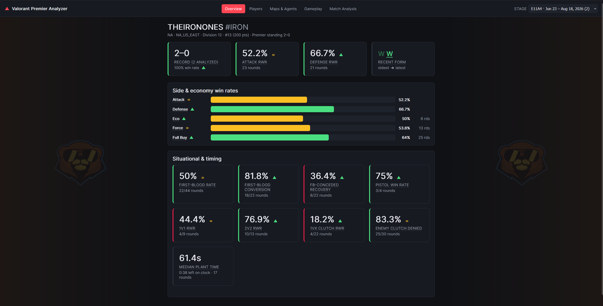
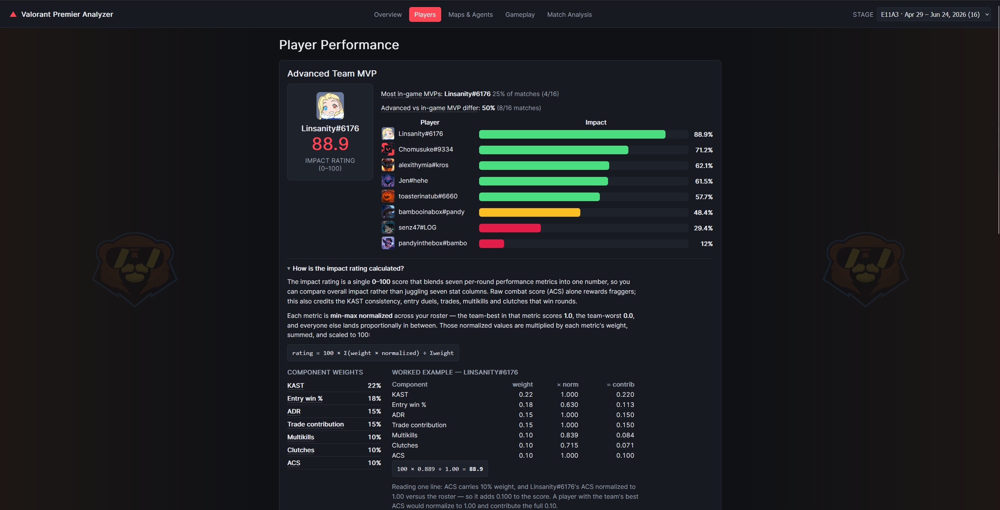
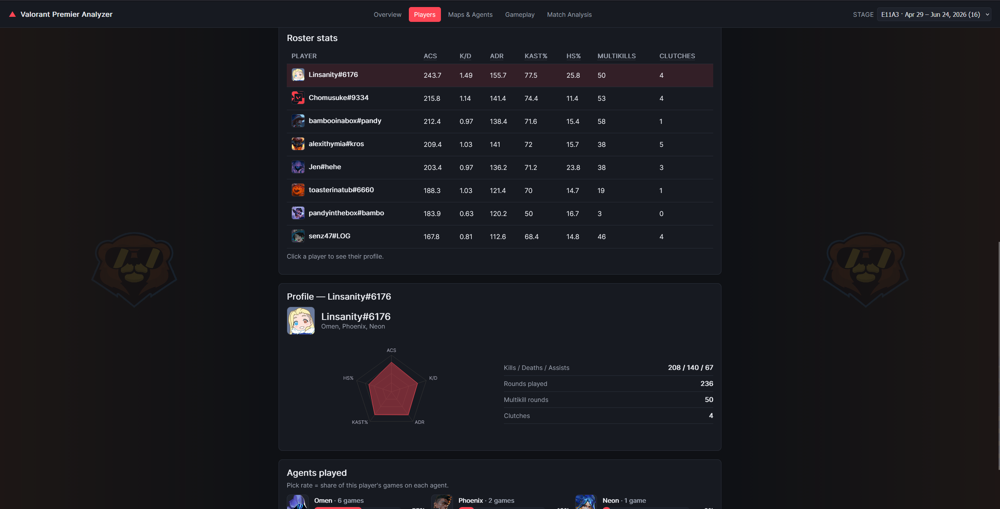
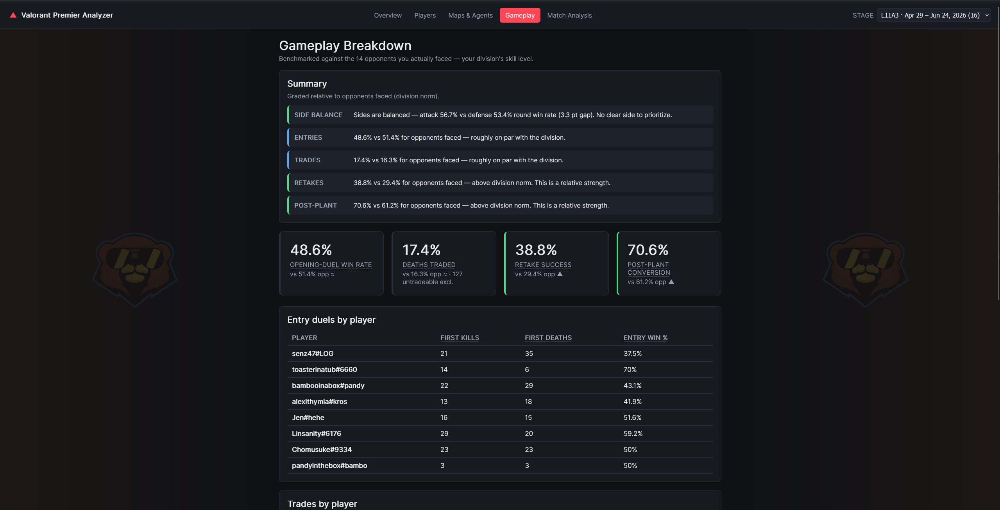
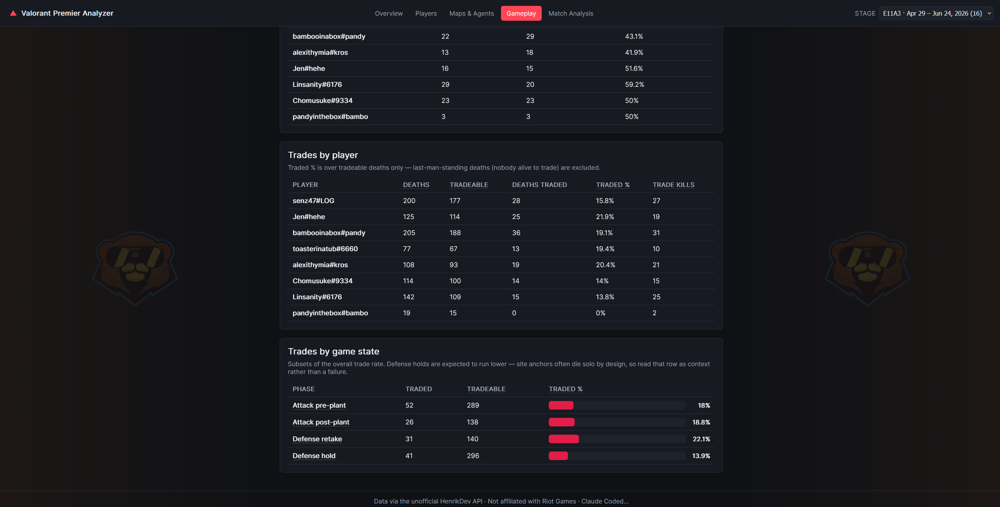
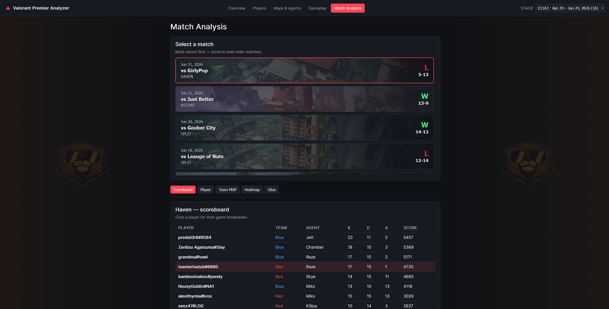
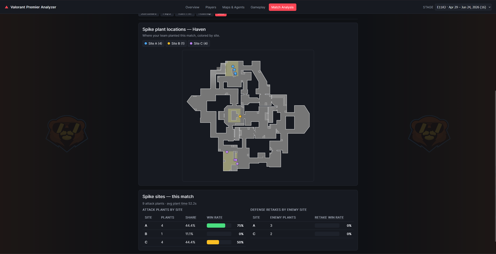

# Valorant Premier Team Performance Analyzer

A web app that analyzes a **Valorant Premier team's** match performance and turns it into
**actionable coaching insight** — entry duels, trades, site holds/retakes, an advanced
team MVP rating, attack/defense splits, and per-player utility usage.

- **Backend:** Python + FastAPI (async HenrikDev client, caching, analytics engine)
- **Frontend:** React + TypeScript (Vite, React Query, Recharts)
- **Data source:** the unofficial [HenrikDev API](https://docs.henrikdev.xyz) — see limitations below.

---

## Screenshots

### Overview
Team record & recent form, the situational & timing stats (first bloods, clutches, pistols,
plant timing), and side/economy win rates — with green/amber/red arrows showing the change
vs. the previous stage.



### Players
Advanced Team MVP (impact rating + in-game-MVP comparison), the roster stats table with
player banners, and a per-player profile (radar, agents played with pick rates).




### Maps & Agents
Selectable map-performance table driving a cumulative kill/death heatmap on the minimap,
plus per-map agent usage.


### Gameplay
Coaching summary benchmarked against the opponents faced, entry/trade/site metrics, and the
trades-by-player / by-game-state breakdowns.




### Match Analysis
Per-match sub-tabs: scoreboard, per-player breakdown, match-scoped Team MVP, positional
heatmap, and spike-site detail.




---

## Why HenrikDev and not the official Riot API?

Riot's **official** Valorant API (`developer.riotgames.com`) has **no Premier endpoints**
— there is no way to look up a Premier team, its roster, or its Premier match history —
and it blocks personal/developer keys for Valorant (production key + RSO required). It is
therefore not usable for a Premier team analyzer.

The **HenrikDev** unofficial API exposes dedicated Premier endpoints (team search, team
details + roster, match history, conferences, leaderboards) plus rich underlying match
data (kill events with timestamps, per-round plant/defuse + economy, per-player
K/D/A/score/headshots/damage, agents). This app is built on it.

> Not affiliated with or endorsed by Riot Games.

---

## Setup

### 1. Get a HenrikDev API key
Create a free key at <https://api.henrikdev.xyz/dashboard> (requires joining their Discord).

### 2. Configure environment
```bash
cp .env.example .env
```
Fill in:
- `HENRIK_API_KEY` — your key
- `PREMIER_TEAM_NAME`, `PREMIER_TEAM_TAG` — your team's name and tag
- `PREMIER_REGION` — `na`, `eu`, `ap`, `kr`, `latam`, or `br`

### 3. Backend (Python 3.10+)
```bash
cd server
python3 -m venv .venv
source .venv/bin/activate           # Windows: .venv\Scripts\activate
pip install -e ".[dev]"
uvicorn app.main:app --reload --port 8000
```
Interactive API docs: <http://localhost:8000/docs>

### 4. Frontend
```bash
cd client
npm install
npm run dev                          # http://localhost:5173 (proxies /api to :8000)
```

### Run both together (optional)
From the repo root, after both installs and creating the venv:
```bash
npm install          # installs "concurrently"
npm run dev          # runs FastAPI + Vite together
```

---

## Deploy to the web (Render, free)

In production the app runs as a **single service** — FastAPI serves both the API and the
built React frontend on one origin — so it deploys as one container. The included
`Dockerfile` builds the frontend and serves everything; `render.yaml` wires up the service.

1. Push this repo to GitHub.
2. On [Render](https://render.com): **New → Blueprint** and pick the repo (it reads
   `render.yaml`), or **New → Web Service → Docker**.
3. Set the **`HENRIK_API_KEY`** environment variable (secret) in the dashboard.
   `PREMIER_TEAM_NAME` / `PREMIER_TEAM_TAG` / `PREMIER_REGION` default from `render.yaml` —
   edit them there if needed.
4. Deploy — you'll get a `https://<name>.onrender.com` URL to share.

**Free-tier notes:** the service spins down after ~15 min idle, so the first visit after a
lull takes ~30–60s to wake, then it's fast. The in-memory cache resets on spin-down and
re-warms on the next load. There's **no login** — anyone with the URL can view (the API key
stays server-side; HenrikDev caching + a small user count keep well within rate limits).

> Same single-container setup runs anywhere Docker does — e.g. Fly.io (`fly launch`) or a
> cheap VPS — if you'd rather avoid cold starts (~$2–5/mo).

---

## What it shows

| Page | Content |
|---|---|
| **Overview** | Team record & recent form, situational & timing stats (first-blood/clutch/pistol rates, plant timing), attack/defense & economy win rates — with stage-over-stage change arrows |
| **Players** | The **Advanced Team MVP** widget, roster stats (ACS, K/D, ADR, KAST%, HS%, multikills, clutches) with player banners, and a per-player profile (radar + agents played) |
| **Maps & Agents** | Selectable per-map performance driving a cumulative kill/death heatmap on the minimap, plus per-map agent usage |
| **Gameplay** | Coaching summary (benchmarked vs the opponents faced), entry duels, trades (overall, per-player, and by game state), retakes & post-plant |
| **Match Analysis** | Per-match sub-tabs — scoreboard, per-player breakdown (agent, stats, utility usage), match-scoped Team MVP, positional heatmap, spike-site detail — plus a round-by-round timeline |

### Global stage filter
- A **stage dropdown in the header** scopes *every* page (Overview, Players, Maps & Agents,
  Gameplay, Match Analysis) to a single Premier stage — e.g. `E11A4 · Jun 23 – Aug 18, 2026`. Stages
  come from the HenrikDev seasons endpoint (only those your team has matches in are shown),
  and filtering is done by each stage's date window. Defaults to the current stage; pick
  "All stages" to analyze everything. Backend: `GET /api/stages` + a `season` query param on
  `/api/analytics/report` and `/api/matches`.

### Advanced metrics
- **Opponent-relative baseline** — the app also analyzes the opponents you actually
  faced and benchmarks your gameplay metrics against them ("you 48% vs opponents 52%").
  Callouts flag only where you trail *your own division*, so a low absolute number that's
  normal for the division isn't misreported as a weakness. Great for lower divisions where
  pro-level benchmarks don't apply.
- **Advanced team MVP** — on the **Players** tab, a composite *impact rating* (KAST, entry
  win rate, ADR, trade contribution, multikills, clutches, ACS; min-max normalized across
  the roster and weighted in `server/app/config.py`). Alongside it: which player earned the
  game-determined (in-game) MVP most often, and how often that differed from the advanced MVP.
- **Stage-over-stage deltas** — when a specific stage is selected, percentage stats across
  the app show a green/amber/red ▲ / ＝ / ▼ vs. the previous stage (hover for the exact change).
- **Attack/defense split** — round win rate by side + eco/force/full-buy win rates.
- **Entries / trades / site play** — opening-duel win %, deaths-traded %, defense
  holds vs retakes, attack post-plant conversion; trades are also split by game state
  (attack pre/post-plant, defense hold/retake). Side per round is inferred from spike
  plant events + the standard 12/12 half structure.
- **Per-match player breakdown** — clicking a scoreboard player on the Match Analysis tab
  opens a card with their agent (icon), that game's ACS/ADR/HS%/KAST/first-bloods/clutches,
  the advanced-MVP impact rating + component breakdown, and **per-round utility usage** with
  the agent's real ability names/icons (mapped from valorant-api.com). A match-scoped
  Advanced Team MVP widget ranks your five players for that single game.
- **Utility = usage only** — ability casts have no timestamps in the API, so utility is
  reported as casts-per-round per ability slot (no kill/assist correlation is possible).
- **Trade rate excludes untradeable deaths** — a death where you were the last player
  alive (no teammate to avenge) is removed from the denominator, so the rate reflects only
  situations where a trade was actually possible.

---

## API limitations (read me)

- **No official Premier data.** Everything Premier-specific comes from HenrikDev.
- **Utility is usage-only.** The match payload exposes ability casts only as per-match
  *aggregate* counts with no timestamps, so casts can't be tied to kills. On the Match
  Analysis player card, utility is shown as **casts-per-round per ability** (mapped to each
  agent's real ability names/icons via valorant-api.com) — not an "impact"/"followed-up"
  causation metric. This is noted in the UI.
- **Clutches / side inference are heuristics** derived from kill order and plant events,
  not explicit API fields.
- **Roster source:** the `/premier/{name}/{tag}` endpoint often returns an empty roster,
  so the app identifies your team inside each match via `teams[].premier_roster.id` and
  reads the participating PUUIDs from there — no manual roster entry needed.
- **Analyzed record vs official standing:** the "Record (N analyzed)" card counts the
  matches actually pulled and analyzed — both league and playoff/tournament matches, and
  there can be several per Premier match night. Your **official Premier standing** (W–L,
  division, points) is shown separately in the header. These two numbers are expected to differ.
- **Field names:** the analytics key off `server/app/models.py`. If HenrikDev changes its
  v4 schema, adjust the models there (confirm against a live sample or the OpenAPI spec at
  <https://api.henrikdev.xyz/docs>). Models are defensive (`extra="ignore"`, optional
  fields) so drift degrades gracefully rather than crashing.

---

## Tests
```bash
cd server && source .venv/bin/activate
pytest -q
```
Deterministic unit tests run against a saved sample match fixture (no network).

---

## Project layout
```
server/   FastAPI backend + analytics engine (app/analytics/*)
client/   React + Vite frontend
.env      your secrets (never committed)
```
